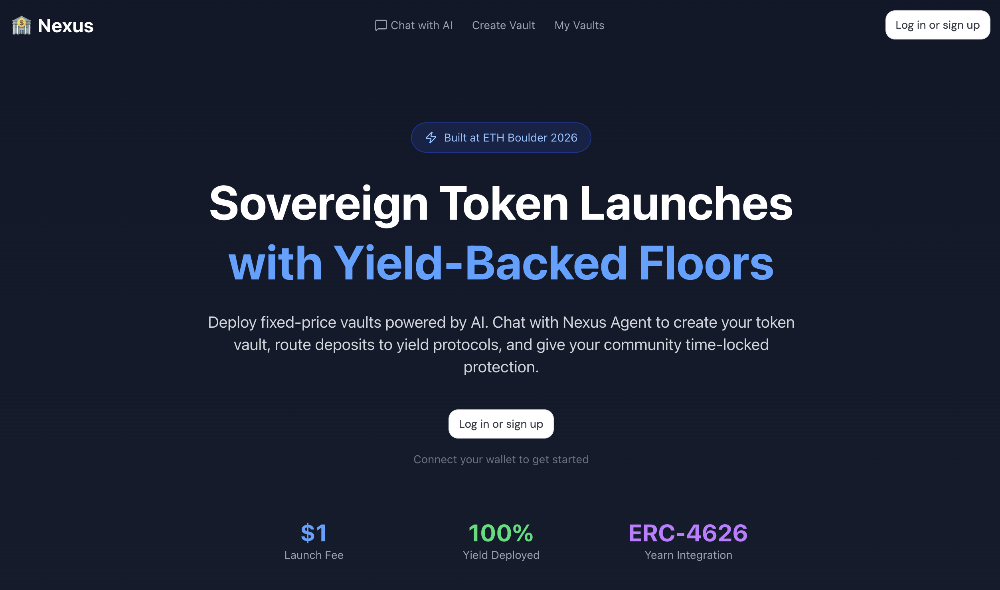
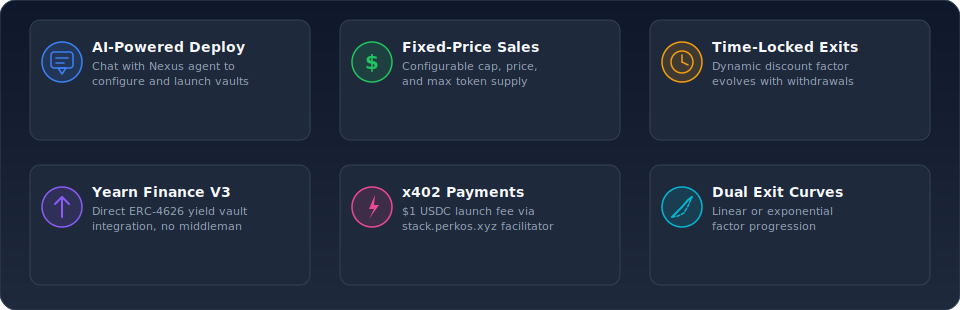
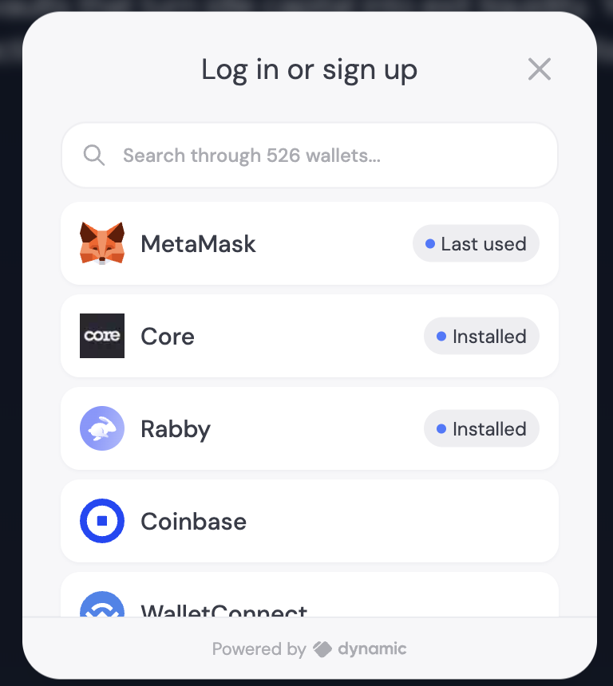
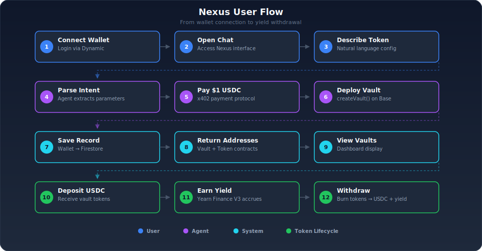
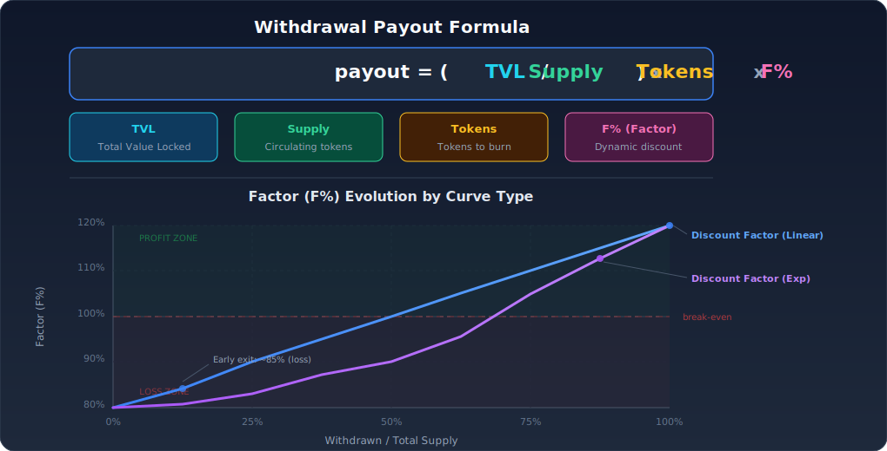
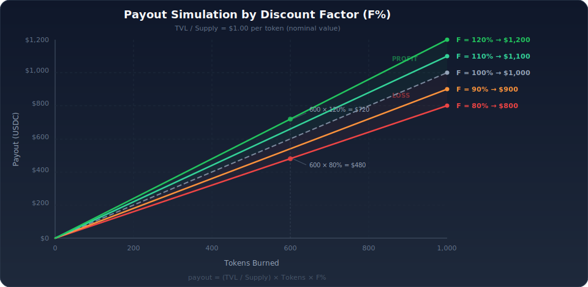
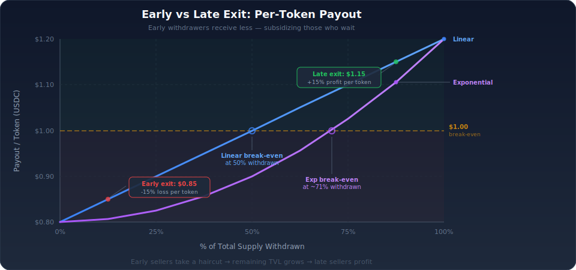
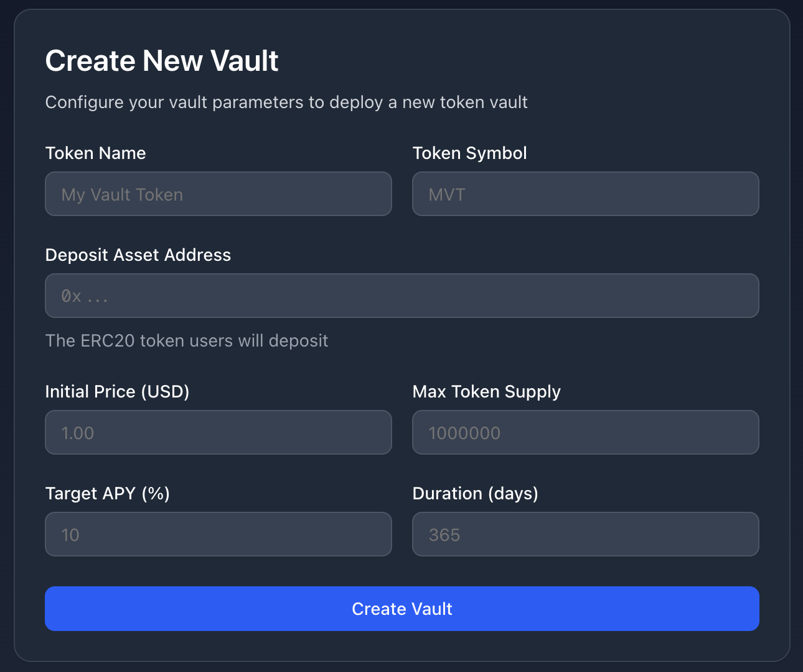

# 🏦 Nexus - Token Vault Launcher

A decentralized vault system for token launches with yield-backed exits, powered by AI agents.

Built for **ETH Boulder 2026** 🏔️

🔗 **Live Demo:** https://nexus-ethboulder.netlify.app

---

## Overview

Nexus enables projects to deploy a vault + ERC-20 token to raise funds at a fixed price with yield-backed exits. 

**How it works:**
1. Users **login with their wallet** (Dynamic)
2. Users **chat with Nexus** (AI agent) to describe their token launch
3. Users **pay $1 USDC** via x402 protocol (stack.perkos.xyz facilitator)
4. Nexus **deploys the vault** on their behalf

Deposits are deployed directly into **Yearn Finance V3 vaults** via ERC-4626, and the generated yield improves exit terms over time.



### Key Features

- **AI-powered deployment** via chat interface
- **Fixed-price token sales** with configurable cap and token price
- **Time-locked exits** with dynamic discount factor
- **Direct Yearn Finance V3 integration** via ERC-4626 (no intermediary)
- **x402 payments** for launch fees ($1 USDC)
- **Linear or exponential exit curves**



---

## System Architecture

```
┌─────────────────────────────────────────────────────────────────────┐
│                     NEXUS FRONTEND (NexusApp)                        │
│              Next.js 16 + Tailwind + shadcn/ui + Dynamic             │
├─────────────────────────────────────────────────────────────────────┤
│  1. User logs in with wallet (Dynamic)                              │
│  2. User accesses Chat Interface                                    │
│  3. Chat sends messages to Nexus Agent via Plugin                   │
│  4. User pays $1 USDC via x402 when prompted                        │
│  5. View deployed vaults + deposit/withdraw                         │
└────────────────────────────┬────────────────────────────────────────┘
                             │
                             │ Nexus Plugin (WebSocket/API)
                             ▼
┌─────────────────────────────────────────────────────────────────────┐
│                       NEXUS AGENT                                    │
│                    (OpenClaw / Clawdbot)                             │
├─────────────────────────────────────────────────────────────────────┤
│  • Receives chat messages from Frontend via Plugin                  │
│  • Understands user intent via natural language                     │
│  • Extracts vault parameters (name, cap, APY, duration)             │
│  • Generates x402 payment request ($1 USDC)                         │
│  • Verifies payment via stack.perkos.xyz facilitator                │
│  • Deploys vault using agent wallet (pays gas)                      │
│  • Saves deployment to Firebase                                     │
│  • Returns vault + token addresses to user                          │
└────────────────────────────┬────────────────────────────────────────┘
                             │
              ┌──────────────┼──────────────┐
              ▼              ▼              ▼
┌─────────────────┐ ┌─────────────────┐ ┌─────────────────┐
│   x402 Payment  │ │    Firebase     │ │  Smart Contracts│
│ stack.perkos.xyz│ │   (Firestore)   │ │     (Base)      │
├─────────────────┤ ├─────────────────┤ ├─────────────────┤
│ • $1 USDC fee   │ │ • users/        │ │ • VaultFactory  │
│ • EIP-712 sigs  │ │ • deployments/  │ │ • Vault         │
│ • Facilitator   │ │ • wallet→vaults │ │ • VaultToken    │
└─────────────────┘ └─────────────────┘ └────────┬────────┘
                                                  │
                                                  ▼
                                         ┌─────────────────┐
                                         │ YEARN V3 VAULT  │
                                         │  (ERC-4626)     │
                                         ├─────────────────┤
                                         │ • Yield source  │
                                         │ • Direct integ. │
                                         └─────────────────┘
```

### Component Details

| Component | Technology | Description |
|-----------|------------|-------------|
| **NexusApp** | Next.js 16 + Dynamic | Frontend with chat UI |
| **Nexus Plugin** | WebSocket/API | Connects frontend ↔ agent |
| **Nexus Agent** | OpenClaw/Clawdbot | AI agent that deploys vaults |
| **x402 Payment** | stack.perkos.xyz | $1 USDC service fee |
| **Firebase** | Firestore | Stores user → deployments |
| **Contracts** | Base Mainnet | VaultFactory + Vault + Token |

---

## User Flow

<p align="center">
  
</p>

```
1. Login              →  User connects wallet via Dynamic
2. Access Chat        →  User opens chat interface in NexusApp
3. Chat with Nexus    →  User describes token launch in natural language
                         "I want to create a token called XYZ with 1M supply..."
4. Nexus Configures   →  Agent extracts vault parameters from conversation
5. Pay Service Fee    →  User pays $1 USDC via x402 (stack.perkos.xyz facilitator)
6. Nexus Deploys      →  Agent deploys VaultFactory.createVault()
7. Save to Firebase   →  Agent saves deployment to Firestore (user wallet → contracts)
8. Receive Addresses  →  Vault + Token contract addresses returned in chat
9. View Deployments   →  User sees their vaults in "My Vaults" section
10. Share & Deposit   →  Users can deposit tokens, receive vault tokens
11. Earn Yield        →  Vault factor increases over time via Yearn Finance V3
12. Withdraw          →  Burn vault tokens, receive principal + yield
```



---

## Nexus Plugin

The Nexus Plugin connects the NexusApp frontend to the Nexus Agent.

### Responsibilities

- Authenticate users via wallet signature
- Send chat messages to Nexus Agent
- Receive responses and x402 payment requests
- Handle payment flow and confirmations
- Stream agent responses to chat UI

### Integration

```
NexusApp (Frontend)
    │
    ├── /chat page
    │   └── ChatInterface component
    │       └── useNexusPlugin() hook
    │           │
    │           ▼
    └── Nexus Plugin (WebSocket/API)
            │
            ▼
        Nexus Agent (OpenClaw)
```

---

## Tech Stack

| Layer | Technology |
|-------|------------|
| **Frontend** | Next.js 16 (App Router) + TypeScript |
| **Styling** | Tailwind CSS + shadcn/ui |
| **Wallet** | Dynamic + wagmi + viem |
| **Agent** | OpenClaw (Clawdbot) |
| **Payments** | x402 protocol + stack.perkos.xyz facilitator |
| **Database** | Firebase (Firestore) |
| **Contracts** | Solidity 0.8.20 + Foundry |
| **Chain** | Base (L2) |
| **Yield** | Yearn Finance V3 (ERC-4626) |

---

## Pricing

| Fee | Amount | Description |
|-----|--------|-------------|
| **Launch Fee** | $1 USDC | Paid via x402 to deploy vault |
| **Platform Fee** | 1% of yield | Ongoing, from generated yield |
| **Gas** | Absorbed | Agent pays gas costs |

---

## Firebase Data Model

Firebase Firestore stores the relationship between user wallets and their deployed contracts.

### Collections

**`users/{walletAddress}`**
```json
{
  "walletAddress": "0x...",
  "createdAt": "2026-02-15T...",
  "deploymentsCount": 3
}
```

**`deployments/{deploymentId}`**
```json
{
  "userWallet": "0x...",
  "vaultAddress": "0x...",
  "tokenAddress": "0x...",
  "tokenName": "My Project Token",
  "tokenSymbol": "MPT",
  "config": {
    "cap": "100000000000",
    "maxTokenSupply": "1000000000000000000000000",
    "initialFactorBps": 8000,
    "projectFeeBps": 500,
    "unlockTimestamp": 1739577600,
    "curveType": "LINEAR"
  },
  "x402PaymentTx": "0x...",
  "deployTx": "0x...",
  "deployedAt": "2026-02-15T...",
  "chain": "base",
  "status": "deployed"
}
```

**`deployments` (subcollection under user)**
- Query: `users/{wallet}/deployments` - Get all deployments for a user

---

## Yearn Finance V3 Integration

The Vault contract integrates **directly** with Yearn Finance V3 vaults using the ERC-4626 standard. No intermediary orchestrator needed.

### Base Mainnet Addresses

| Contract | Address |
|----------|---------|
| **Yearn Registry** | `0xd40ecF29e001c76Dcc4cC0D9cd50520CE845B038` |
| **Role Manager** | `0xea3481244024E2321cc13AcAa80df1050f1fD456` |
| **VaultFactory (Yearn)** | `0x770D0d1Fb036483Ed4AbB6d53c1C88fb277D812F` |
| **4626 Router** | `0x1112dbCF805682e828606f74AB717abf4b4FD8DE` |

### How It Works

1. User deposits USDC → Vault mints VaultTokens 1:1
2. Vault deposits USDC into Yearn Finance V3 vault → receives yield-bearing shares
3. Yield accrues in Yearn Finance vault over time
4. On withdrawal: Vault redeems shares, applies discount factor, transfers USDC

```solidity
// Vault.sol - Direct ERC-4626 integration
IERC4626 public immutable yieldVault;

function deposit(uint256 amount) external {
    depositAsset.safeTransferFrom(msg.sender, address(this), amount);
    depositAsset.approve(address(yieldVault), amount);
    uint256 shares = yieldVault.deposit(amount, address(this));
    // ...
}
```

---

## Economic Model



### Withdrawal Formula

```
payout = (TVL / supply) × tokens_to_burn × F%
```

Where:
- **TVL** = Total Value Locked (grows with yield from Yearn Finance)
- **supply** = Circulating token supply (decreases with burns)
- **F%** = Discount factor (0.8 → 1.0 → 1.2+)



### Factor Evolution

The discount factor starts at the configured initial value (e.g., 80%) and evolves based on withdrawals:

- **0.8 (80%)** → Seller receives 80% of nominal value (-20% loss)
- **1.0 (100%)** → Break-even point
- **1.2 (120%)** → Seller receives 120% of nominal value (+20% profit)

### Curve Types

```
LINEAR CURVE:
  factor = initialFactor + (maxFactor - initialFactor) × (withdrawn / totalSupply)
  
EXPONENTIAL CURVE:
  factor = initialFactor + (maxFactor - initialFactor) × (withdrawn / totalSupply)²
```



---

## Smart Contracts

### VaultFactory.sol

Deploys new Vault + VaultToken pairs with configurable parameters.

```solidity
struct VaultConfig {
    string name;              // Token name
    string symbol;            // Token symbol
    address depositAsset;     // e.g., USDC
    uint256 cap;              // Maximum raise amount
    uint256 unlockTimestamp;  // When exits become available
    uint256 initialFactorBps; // Initial discount factor (e.g., 8000 = 80%)
    uint256 projectFeeBps;    // Project share of yield
    address projectWallet;    // Receives project fees
    address yieldVault;       // Yearn V3 vault address (ERC-4626)
    CurveType curveType;      // LINEAR or EXPONENTIAL
}

function createVault(VaultConfig calldata config) external returns (address vault, address token);
```

### Vault.sol

Core vault logic: deposits, withdrawals, yield distribution, and factor calculation.

```solidity
// State
IERC4626 public immutable yieldVault;  // Yearn V3 vault
uint256 public totalPrincipal;          // Deposited principal
uint256 public totalShares;             // Shares in yield vault

// Core functions
function deposit(uint256 amount) external;
function withdraw(uint256 tokenAmount) external;
function harvestYield() external;
function recalculateFactor() external;

// View functions
function getTVL() external view returns (uint256);
function getAccumulatedYield() external view returns (uint256);
function previewWithdraw(uint256 tokenAmount) external view returns (uint256);
function getCurrentFactor() external view returns (uint256);
```

---

## Critical Implementation Notes

### ⚠️ Rounding Rules

ALL calculations MUST round in favor of the vault (treasury):

- Payout calculations → round DOWN (floor)
- Fee calculations → round DOWN for user, UP for vault
- Share conversions → round DOWN when redeeming

```solidity
// Solidity: division automatically rounds down (floor)
uint256 payout = (tvl * tokens * factorBps) / (supply * 10000);
// This naturally favors the vault ✓
```

### ⚠️ Capital Protection Rule

Initial capital (principal) is ONLY touched when F% < 100%:

```
Case A: F = 0.80 (80%)
  → User receives 80 USDC for 100 tokens
  → 20 USDC stays in treasury (from principal)
  → Principal is touched ⚠️

Case B: F = 1.00 (100%)
  → User receives exactly their principal
  → Break-even point ✓

Case C: F = 1.20 (120%)
  → User receives 120 USDC (20 from yield)
  → Principal untouched ✓
```

---

## Project Structure

```
Nexus/
├── contracts/              # Smart contracts (Foundry)
│   ├── src/
│   │   ├── VaultFactory.sol
│   │   ├── Vault.sol
│   │   ├── VaultToken.sol
│   │   └── interfaces/
│   ├── test/
│   └── script/
├── NexusApp/               # Frontend (Next.js App Router)
│   ├── app/                # Routes
│   │   ├── layout.tsx      # Root layout + DynamicProvider
│   │   ├── page.tsx        # Landing page
│   │   ├── create/         # /create - Deploy vault form
│   │   └── liquidity/      # /liquidity - Vault cards + deposit/withdraw
│   ├── components/ui/      # shadcn/ui components
│   ├── providers/          # Dynamic wallet provider
│   └── lib/                # Utilities
├── agent/                  # Nexus Agent Skill (OpenClaw)
│   ├── SKILL.md            # Skill definition
│   ├── config.json         # Contract addresses & config
│   ├── scripts/            # Agent scripts
│   │   ├── vault-read.mjs      # Read vault state
│   │   ├── vault-preview.mjs   # Preview withdrawal
│   │   └── vault-create.mjs    # Generate create links
│   └── prompts/
│       └── vault-intents.md    # Voice command patterns
├── scripts/                # Deployment scripts
└── docs/                   # Documentation
```

---

## Nexus Agent

The Nexus Agent is an AI-powered assistant that helps users deploy Token Vaults via natural language.

### Features

- **Conversational deployment** — Users describe their token in chat
- **Parameter extraction** — Agent extracts vault config from conversation
- **x402 payments** — Handles $1 USDC service fee
- **Vault management** — Read state, preview withdrawals

### Agent Skill

The agent uses the `nexus-vault` skill located in `/agent`:

| Script | Description |
|--------|-------------|
| `vault-read.mjs` | Read vault TVL, factor, yield |
| `vault-preview.mjs` | Preview withdrawal payout |
| `vault-create.mjs` | Generate pre-configured create links |

### Deployment

The Nexus Agent runs on OpenClaw (Clawdbot) and connects to the frontend via the Nexus Plugin.

```
NexusApp (Chat UI) ←→ Nexus Plugin ←→ Nexus Agent (OpenClaw)
                                            │
                    ┌───────────────────────┼───────────────────────┐
                    ▼                       ▼                       ▼
              x402 Payment            Firebase              Smart Contracts
           (stack.perkos.xyz)        (Firestore)               (Base)
```

### Environment Variables

Create `.env` for the agent (never commit to repo):

```bash
NEXUS_RPC_URL=https://mainnet.base.org
NEXUS_APP_URL=https://nexus-ethboulder.netlify.app
NEXUS_FIREBASE_PROJECT=<your-firebase-project>
NEXUS_FIREBASE_SA_PATH=<path-to-service-account.json>
# API keys stored separately via: openclaw configure --section models
```

---

## Tech Stack

- **Contracts:** Solidity 0.8.20+, Foundry, OpenZeppelin, Solady
- **Frontend:** Next.js 16 (App Router), TypeScript, Tailwind, shadcn/ui, wagmi, viem
- **Wallet:** Dynamic
- **Agent:** Nexus (OpenClaw/Clawdbot)
- **Chain:** Base (L2)
- **Yield:** Yearn Finance V3 (direct ERC-4626 integration)

---

## Quick Start

```bash
# Clone
git clone https://github.com/PerkOS-xyz/ethboulder-2026
cd ethboulder-2026

# Install dependencies
cd contracts
forge install

# Run tests
forge test

# Deploy to Base mainnet
forge script script/Deploy.s.sol --rpc-url base --broadcast --verify
```

---

## Deployed Contracts (Base Mainnet)

| Contract | Address | Verified |
|----------|---------|----------|
| **VaultFactory v3** | [`0x9Df66106201d04CF8398d6387C2D022eb9353c73`](https://basescan.org/address/0x9Df66106201d04CF8398d6387C2D022eb9353c73) | ✅ Sourcify |

**Deployment Details:**
- Network: Base (Chain ID 8453)
- Deployer/Owner: `0x63d9095efAc96bE8AdA090Da510cb8E8120D6B74`
- Platform Fee: 1% (100 bps)

---

## Vault Configuration



When creating a vault, you can configure:

| # | Parameter | Description | Example |
|---|-----------|-------------|---------|
| 1 | `name` | Token name | "My Project Token" |
| 2 | `symbol` | Token symbol | "MPT" |
| 3 | `depositAsset` | Asset to raise (USDC) | `0x833589fCD...` |
| 4 | `cap` | Maximum raise amount | 100,000 USDC |
| 5 | `maxTokenSupply` | Total tokens to issue | 1,000,000 tokens |
| 6 | `unlockTimestamp` | When exits unlock | Unix timestamp |
| 7 | `initialFactorBps` | Initial exit discount | 8000 (80% = 20% loss) |
| 8 | `projectFeeBps` | Project's yield share | 500 (5%) |
| 9 | `projectWallet` | Fee recipient (multisig) | `0x...` |
| 10 | `yieldVault` | Yearn Finance V3 vault | `0xb13CF...` |
| 11 | `curveType` | Factor curve | LINEAR or EXPONENTIAL |

### Token Price Calculation

```
tokenPrice = cap / maxTokenSupply
```

**Example:**
- Cap: 100,000 USDC
- Max Supply: 1,000,000 tokens
- **Token Price: 0.10 USDC**

When user deposits 10 USDC → receives 100 tokens

---

### Test Vault (Price Test Token)
| Contract | Address |
|----------|---------|
| Vault | [`0x6197714ba09e54050352b612d7e7fb3ca224963d`](https://basescan.org/address/0x6197714ba09e54050352b612d7e7fb3ca224963d) |
| PTT Token | [`0x547130fa7297b5d234e2777e72f1b4240faab44e`](https://basescan.org/address/0x547130fa7297b5d234e2777e72f1b4240faab44e) |

**Test Results:**
- Cap: 100 USDC | Max Supply: 1000 PTT
- Token Price: 0.10 USDC
- Deposited 0.5 USDC → Received 5 PTT ✅

---

## Deployment

### Prerequisites

1. Set environment variables in `contracts/.env`:
```bash
PRIVATE_KEY=0x...
BASE_RPC_URL=https://base-mainnet.g.alchemy.com/v2/YOUR_KEY
BASESCAN_API_KEY=...
```

2. Find a Yearn Finance V3 vault for your asset:
   - Check https://yearn.fi/v3 → Base
   - Or query the registry: `0xd40ecF29e001c76Dcc4cC0D9cd50520CE845B038`

### Deploy

```bash
# Deploy VaultFactory
forge script script/Deploy.s.sol:DeployScript --rpc-url base --broadcast --verify

# Create a vault
forge script script/Deploy.s.sol:CreateVault --rpc-url base --broadcast
```

---

## Environment Variables

```bash
# contracts/.env
PRIVATE_KEY=0x...
BASE_RPC_URL=https://base-mainnet.g.alchemy.com/v2/YOUR_KEY
BASESCAN_API_KEY=...

# NexusApp/.env.local
NEXT_PUBLIC_DYNAMIC_ENV_ID=your_dynamic_environment_id
NEXT_PUBLIC_CHAIN_ID=84532
NEXT_PUBLIC_RPC_URL=https://sepolia.base.org
NEXT_PUBLIC_VAULT_FACTORY_ADDRESS=0x...
```

---

## License

MIT License — Built for ETH Boulder 2026 🏔️
