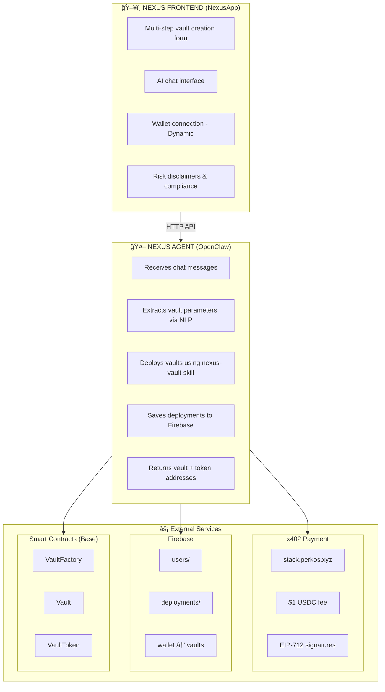
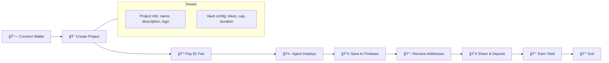

# 🦠Nexus - Token Vault Launcher

AI-powered sovereign token launches with yield-backed floors.

**Built for ETH Boulder 2026** ğŸ”ï¸

🔗 **Live Demo:** https://nexus.perkos.xyz  
📱 **Telegram:** @NexusPerkOS_Bot  
🙠**GitHub:** https://github.com/PerkOS-xyz/Nexus

---

## Overview

Nexus enables projects to deploy a vault + ERC-20 token to raise funds at a fixed price with yield-backed exits.

**How it works:**
1. **Chat** with Nexus AI Agent to describe your token launch
2. **Pay** $1 USDC via x402 protocol
3. **Deploy** — the agent creates your vault on Base
4. **Earn** — deposits route to Yearn V3 for yield
5. **Exit** — users burn tokens to claim USDC + yield

All deposits are deployed directly into **Yearn V3 vaults** via ERC-4626, and the generated yield improves exit terms over time.

---

## Features

| Feature | Description |
|---------|-------------|
| **AI-Powered** | Chat with Nexus Agent to create vaults in natural language |
| **Yield-Backed** | 100% of deposits earn yield via Yearn V3 |
| **Fixed Price** | No AMM complexity — simple fixed-price sales |
| **Time-Locked** | Configurable lock periods align incentives |
| **$1 Launch Fee** | Just $1 USDC to deploy via x402 protocol |
| **Voice Ready** | OmiMesh integration for hands-free monitoring |

---

## Chat Examples

Here are examples of how to interact with the Nexus AI Agent:

### 🚀 Creating a Vault

**You:** "I want to create a token called Solar DAO with symbol SOLAR, raising 50,000 USDC with a 30-day lock period"

**Nexus:** 
```
Great! Here's your vault configuration:

📋 Token: Solar DAO (SOLAR)
💰 Funding Cap: 50,000 USDC
â±ï¸ Lock Period: 30 days
📈 Initial Factor: 80%

Service fee: $1 USDC

Ready to deploy? Please confirm the payment to proceed.
```

---

### 📊 Checking Vault Status

**You:** "What's the status of my vault?"

**Nexus:**
```
📊 Vault Status: Solar DAO (SOLAR)

💰 TVL: 25,000 USDC
📈 Current Factor: 85%
🪙 Circulating Supply: 250,000 SOLAR
💵 Yield Earned: 312.50 USDC
🔒 Status: Locked (unlocks in 18 days)

Your holdings: 10,000 SOLAR (~$850 current value)
```

---

### 💸 Previewing a Withdrawal

**You:** "How much would I get if I withdraw 5,000 tokens?"

**Nexus:**
```
📋 Withdrawal Preview

🪙 Tokens to burn: 5,000 SOLAR
📈 Current Factor: 95%
💵 Estimated Payout: 527.50 USDC

âš ï¸ Note: The vault is still locked. Withdrawals 
will be available on March 15, 2026.
```

---

### 💰 Making a Deposit

**You:** "I want to deposit 1,000 USDC into the Solar DAO vault"

**Nexus:**
```
💰 Deposit Preview

📥 Amount: 1,000 USDC
🪙 Tokens to receive: 10,000 SOLAR
📠Vault: 0x7d94...2329

Click here to complete your deposit →
[Deposit 1,000 USDC]
```

---

### 🔓 Withdrawing Funds

**You:** "I want to withdraw all my tokens"

**Nexus:**
```
🔓 Withdrawal Ready

🪙 Your balance: 10,000 SOLAR
📈 Current Factor: 102%
💵 Estimated Payout: 1,071.00 USDC
📊 Profit: +71 USDC (+7.1%)

Click here to complete your withdrawal →
[Withdraw All]
```

---

### â“ Asking Questions

**You:** "How does the yield work?"

**Nexus:**
```
Great question! Here's how yield works in Nexus:

1. When you deposit USDC, 100% goes to Yearn V3 vaults
2. Yearn generates yield through DeFi strategies
3. The yield increases the vault's TVL
4. As TVL grows, your exit value improves

Example: If the vault earns 10% APY and you hold 
for a year, your tokens will be worth ~10% more 
when you withdraw (assuming constant supply).

The Dynamic Factor (F%) also improves over time, 
starting at 80% and increasing to 100%+ as the 
vault matures.
```

---

### 🤠Voice Commands (OmiMesh)

You can also use voice commands:

- *"Hey Nexus, check my vault status"*
- *"What's my current balance?"*
- *"How much yield has my vault earned?"*
- *"Preview a withdrawal of 1000 tokens"*

---

## System Architecture



---

## User Flow



---

## Vault Lifecycle


---

## Tech Stack

| Layer | Technology |
|-------|------------|
| **Frontend** | Next.js 16 + TypeScript + Tailwind |
| **UI** | shadcn/ui components |
| **Wallet** | Dynamic + wagmi + viem |
| **AI Agent** | OpenClaw (Clawdbot) |
| **Payments** | x402 protocol (stack.perkos.xyz) |
| **Database** | Firebase Firestore |
| **Contracts** | Solidity 0.8.20 + Foundry |
| **Chain** | Base L2 |
| **Yield** | Yearn V3 (ERC-4626) |

---

## Smart Contracts (Base Mainnet)

| Contract | Address |
|----------|---------|
| **VaultFactory** | `0x9Df66106201d04CF8398d6387C2D022eb9353c73` |
| **USDC** | `0x833589fCD6eDb6E08f4c7C32D4f71b54bdA02913` |
| **Yearn USDC Vault** | `0xb13cf163d916917d9cd6e836905ca5f12a1def4b` |

---

## Vault Economics

### Core Formula
```
payout = (TVL / supply) × tokens_to_burn × F%
```

- **TVL** grows with yield from Yearn
- **Supply** decreases as users burn tokens
- **F%** = Dynamic Discount Factor (80% → 120% over time)

### Example
```
Initial:
  TVL: 100,000 USDC
  Supply: 100,000 tokens
  F%: 80%
  → 1 token = 0.80 USDC

After 1 year (10% yield):
  TVL: 110,000 USDC
  Supply: 90,000 tokens (10k burned)
  F%: 100%
  → 1 token = 1.22 USDC
```

---

## Agent Skill

The `nexus-vault` skill enables the AI agent to:

1. **Deploy Vaults** — `vault-deploy.mjs`
2. **Read Vault State** — `vault-read.mjs`
3. **Preview Withdrawals** — `vault-preview.mjs`

### Deploy Script
```bash
cd agent/scripts
node vault-deploy.mjs \
  --name "My Token" \
  --symbol "MTK" \
  --cap 10000 \
  --user 0x...
```

---

## Project Structure

```
ethboulder-2026/
├── NexusApp/              # Next.js frontend
│   ├── app/
│   │   ├── page.tsx       # Landing page
│   │   ├── chat/          # AI chat interface
│   │   ├── create/        # Multi-step vault creation
│   │   ├── liquidity/     # User's vaults
│   │   └── api/chat/      # Chat API proxy
│   └── components/
│       ├── ui/            # shadcn components
│       ├── chat/          # Chat components
│       └── legal/         # Disclaimers
├── agent/                 # Nexus Agent skill
│   ├── SKILL.md
│   ├── scripts/           # Vault deployment scripts
│   └── prompts/           # Voice command patterns
├── contracts/             # Solidity contracts
│   ├── src/
│   │   ├── VaultFactory.sol
│   │   ├── Vault.sol
│   │   └── VaultToken.sol
│   └── script/
└── README.md
```

---

## Local Development

### Frontend
```bash
cd NexusApp
npm install
npm run dev
```

### Contracts
```bash
cd contracts
forge build
forge test
```

### Deploy Contract
```bash
source .env
forge script script/Deploy.s.sol --rpc-url $BASE_RPC_URL --broadcast
```

---

## Environment Variables

### Frontend (Netlify)
```
NEXUS_AGENT_URL=https://agent.nexus.perkos.xyz
NEXUS_AGENT_TOKEN=<gateway-token>
NEXT_PUBLIC_DYNAMIC_ENV_ID=<dynamic-id>
```

### Agent (VPS)
```
PRIVATE_KEY=0x...
BASE_RPC_URL=https://mainnet.base.org
VAULT_FACTORY=0x9Df66106201d04CF8398d6387C2D022eb9353c73
USDC=0x833589fCD6eDb6E08f4c7C32D4f71b54bdA02913
```

---

## Pricing

| Fee | Amount | Description |
|-----|--------|-------------|
| **Launch Fee** | $1 USDC | Paid via x402 to deploy vault |
| **Platform Fee** | 1% of yield | Ongoing, from generated yield |
| **Project Fee** | Configurable | Your share of yield |
| **Gas** | Absorbed | Agent pays deployment gas |

---

## Risks & Disclaimers

âš ï¸ **Experimental Software** — This platform is provided "AS IS" without warranties.

- **Third-Party Risk** — Funds are deposited into Yearn/external protocols
- **Smart Contract Risk** — Contracts may contain vulnerabilities
- **Yield Risk** — APY is not guaranteed; principal loss possible
- **Irreversible** — Blockchain transactions cannot be undone

See the [full disclaimer](https://nexus.perkos.xyz) in the app footer.

---

## License

Business Source License 1.1 (BSL)

Free for use up to $5,000,000 TVL. Commercial license required beyond that limit.

---

## Team

Built by **PerkOS** at ETH Boulder 2026.

- 🦠[@PerkOS_xyz](https://twitter.com/PerkOS_xyz)
- 🙠[github.com/PerkOS-xyz](https://github.com/PerkOS-xyz)

---

## Acknowledgments

- **ETH Boulder 2026** — Hackathon home
- **Yearn Finance** — Yield infrastructure
- **Base** — L2 deployment
- **Dynamic** — Wallet connection
- **OpenClaw** — AI agent framework
